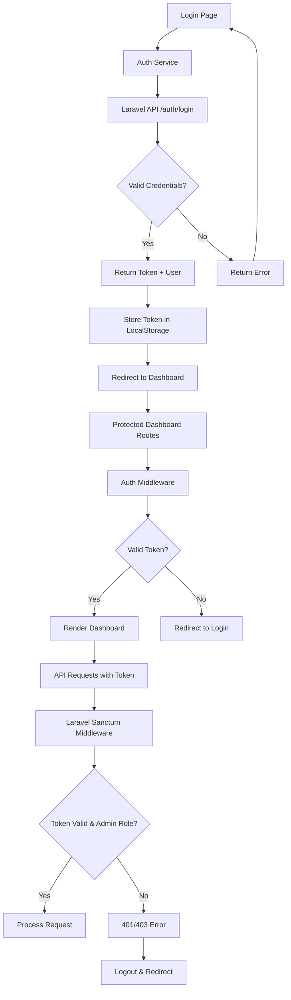
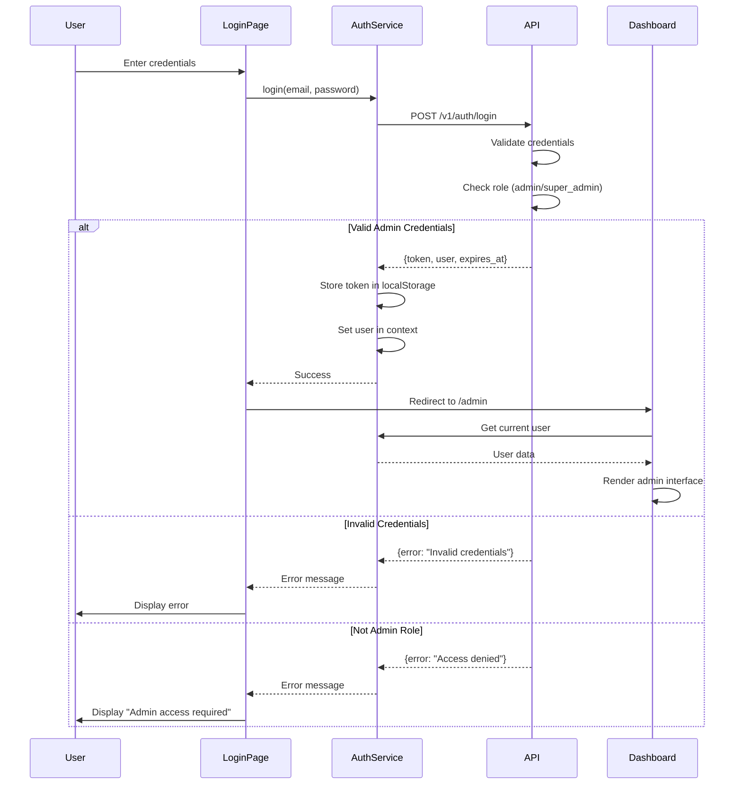

# Design Document: Dashboard Authentication

## Overview

This feature implements a complete authentication flow connecting the Next.js dashboard frontend to the Laravel API backend. It includes login pages, session management, role-based access control (admin and super_admin), and secure token handling using Laravel Sanctum. The authentication system ensures that only authorized administrators can access the dashboard while providing a seamless user experience with automatic token refresh and proper error handling.

## Architecture



## Main Authentication Flow



## Components and Interfaces

### Component 1: Login Page

**Purpose**: Provides the user interface for admin authentication

**Interface**:
```typescript
// app/login/page.tsx
interface LoginPageProps {}

interface LoginFormData {
  email: string;
  password: string;
}

interface LoginFormErrors {
  email?: string;
  password?: string;
  general?: string;
}
```

**Responsibilities**:
- Render login form with email and password fields
- Validate form inputs client-side
- Handle form submission
- Display error messages
- Redirect to dashboard on successful login
- Show loading states during authentication

### Component 2: Auth Context Provider

**Purpose**: Manages global authentication state across the application

**Interface**:
```typescript
// contexts/AuthContext.tsx
interface AuthContextType {
  user: AdminUser | null;
  isLoading: boolean;
  isAuthenticated: boolean;
  login: (email: string, password: string) => Promise<void>;
  logout: () => Promise<void>;
  refreshToken: () => Promise<void>;
}

interface AdminUser {
  id: number;
  name: string;
  email: string;
  role: 'admin' | 'super_admin';
  email_verified_at: string | null;
  last_seen_at: string | null;
}
```

**Responsibilities**:
- Maintain current user state
- Provide authentication methods (login, logout, refresh)
- Handle token storage and retrieval
- Automatically refresh tokens before expiration
- Provide authentication status to all components

### Component 3: Auth Middleware

**Purpose**: Protects dashboard routes from unauthorized access

**Interface**:
```typescript
// middleware.ts
interface MiddlewareConfig {
  matcher: string[];
}

function middleware(request: NextRequest): NextResponse;
```

**Responsibilities**:
- Check for valid authentication token
- Verify token hasn't expired
- Redirect unauthenticated users to login
- Allow access to authenticated admins
- Handle token refresh if needed

### Component 4: Enhanced API Service

**Purpose**: Handles all HTTP requests to the Laravel API with authentication

**Interface**:
```typescript
// lib/api.ts (enhanced)
interface ApiService {
  setToken(token: string): void;
  getToken(): string | null;
  clearToken(): void;
  
  auth: {
    login(email: string, password: string): Promise<ApiResponse<LoginResponse>>;
    logout(): Promise<ApiResponse<void>>;
    refresh(): Promise<ApiResponse<RefreshResponse>>;
    me(): Promise<ApiResponse<AdminUser>>;
  };
}

interface LoginResponse {
  user: AdminUser;
  token: string;
  expires_at: string;
}

interface RefreshResponse {
  token: string;
  expires_at: string;
}
```

**Responsibilities**:
- Add Authorization header to all requests
- Handle 401 errors (token expired)
- Handle 403 errors (insufficient permissions)
- Retry failed requests after token refresh
- Provide type-safe API methods

## Data Models

### Model 1: AdminUser

```typescript
interface AdminUser {
  id: number;
  uuid: string;
  name: string;
  username: string;
  email: string;
  role: 'admin' | 'super_admin';
  status: 'active' | 'suspended' | 'banned';
  email_verified_at: string | null;
  last_seen_at: string | null;
  created_at: string;
  updated_at: string;
}
```

**Validation Rules**:
- role must be 'admin' or 'super_admin' for dashboard access
- status must be 'active' to login
- email must be verified (email_verified_at not null)

### Model 2: AuthToken

```typescript
interface AuthToken {
  token: string;
  expires_at: string;
  created_at: string;
}
```

**Validation Rules**:
- token must be a valid Laravel Sanctum token
- expires_at must be in the future
- token must be stored securely in localStorage

### Model 3: LoginCredentials

```typescript
interface LoginCredentials {
  email: string;
  password: string;
}
```

**Validation Rules**:
- email must be valid email format
- email is required
- password is required
- password minimum length: 8 characters

## Algorithmic Pseudocode

### Main Authentication Algorithm

```typescript
async function authenticateAdmin(credentials: LoginCredentials): Promise<AuthResult> {
  // INPUT: credentials with email and password
  // OUTPUT: AuthResult with success status and user data or error
  
  // Precondition: credentials.email is valid email format
  // Precondition: credentials.password is non-empty
  
  try {
    // Step 1: Validate input
    if (!isValidEmail(credentials.email)) {
      return { success: false, error: 'Invalid email format' };
    }
    
    if (credentials.password.length < 8) {
      return { success: false, error: 'Password too short' };
    }
    
    // Step 2: Send login request to API
    const response = await fetch(`${API_URL}/v1/auth/login`, {
      method: 'POST',
      headers: { 'Content-Type': 'application/json' },
      body: JSON.stringify(credentials)
    });
    
    const data = await response.json();
    
    // Step 3: Handle response
    if (!response.ok) {
      return { success: false, error: data.message || 'Login failed' };
    }
    
    // Step 4: Verify admin role
    if (!['admin', 'super_admin'].includes(data.data.user.role)) {
      return { success: false, error: 'Admin access required' };
    }
    
    // Step 5: Store authentication data
    localStorage.setItem('admin_token', data.data.token);
    localStorage.setItem('token_expires_at', data.data.expires_at);
    localStorage.setItem('admin_user', JSON.stringify(data.data.user));
    
    // Step 6: Schedule token refresh
    scheduleTokenRefresh(data.data.expires_at);
    
    return {
      success: true,
      user: data.data.user,
      token: data.data.token
    };
    
  } catch (error) {
    return {
      success: false,
      error: 'Network error. Please try again.'
    };
  }
  
  // Postcondition: If success, token is stored in localStorage
  // Postcondition: If success, user has admin or super_admin role
}
```

**Preconditions**:
- credentials.email is a valid email format
- credentials.password is non-empty string
- API endpoint is accessible

**Postconditions**:
- If successful: token is stored in localStorage
- If successful: user object is stored in localStorage
- If successful: user.role is 'admin' or 'super_admin'
- If failed: error message is returned
- No sensitive data is logged

**Loop Invariants**: N/A (no loops in main flow)

### Token Refresh Algorithm

```typescript
async function refreshAuthToken(): Promise<RefreshResult> {
  // INPUT: Current token from localStorage
  // OUTPUT: RefreshResult with new token or error
  
  // Precondition: Token exists in localStorage
  // Precondition: User is authenticated
  
  const currentToken = localStorage.getItem('admin_token');
  
  if (!currentToken) {
    return { success: false, error: 'No token found' };
  }
  
  try {
    // Step 1: Request new token
    const response = await fetch(`${API_URL}/v1/auth/refresh`, {
      method: 'POST',
      headers: {
        'Authorization': `Bearer ${currentToken}`,
        'Content-Type': 'application/json'
      }
    });
    
    const data = await response.json();
    
    // Step 2: Handle response
    if (!response.ok) {
      // Token is invalid, logout user
      clearAuthData();
      return { success: false, error: 'Session expired' };
    }
    
    // Step 3: Update stored token
    localStorage.setItem('admin_token', data.data.token);
    localStorage.setItem('token_expires_at', data.data.expires_at);
    
    // Step 4: Schedule next refresh
    scheduleTokenRefresh(data.data.expires_at);
    
    return {
      success: true,
      token: data.data.token,
      expires_at: data.data.expires_at
    };
    
  } catch (error) {
    return {
      success: false,
      error: 'Failed to refresh token'
    };
  }
  
  // Postcondition: If success, new token is stored
  // Postcondition: If failed, user is logged out
}
```

**Preconditions**:
- Valid token exists in localStorage
- Token is not expired
- API endpoint is accessible

**Postconditions**:
- If successful: new token replaces old token in localStorage
- If successful: new expiration time is stored
- If failed: authentication data is cleared
- Next refresh is scheduled

**Loop Invariants**: N/A

### Protected Route Check Algorithm

```typescript
function checkRouteAccess(pathname: string, token: string | null): RouteAccessResult {
  // INPUT: pathname (requested route), token (auth token)
  // OUTPUT: RouteAccessResult with allowed status and redirect path
  
  // Precondition: pathname is a valid route string
  
  const publicRoutes = ['/login', '/forgot-password', '/reset-password'];
  const protectedRoutes = ['/admin'];
  
  // Step 1: Check if route is public
  if (publicRoutes.some(route => pathname.startsWith(route))) {
    // If authenticated, redirect to dashboard
    if (token && isTokenValid(token)) {
      return { allowed: false, redirect: '/admin' };
    }
    return { allowed: true };
  }
  
  // Step 2: Check if route is protected
  if (protectedRoutes.some(route => pathname.startsWith(route))) {
    // Require authentication
    if (!token) {
      return { allowed: false, redirect: '/login' };
    }
    
    // Check token validity
    if (!isTokenValid(token)) {
      return { allowed: false, redirect: '/login' };
    }
    
    return { allowed: true };
  }
  
  // Step 3: Default behavior for other routes
  return { allowed: true };
  
  // Postcondition: Protected routes require valid token
  // Postcondition: Public routes redirect authenticated users
}
```

**Preconditions**:
- pathname is a non-empty string
- token is either null or a string

**Postconditions**:
- Protected routes without valid token redirect to /login
- Public routes with valid token redirect to /admin
- Result always contains allowed boolean
- If not allowed, redirect path is provided

**Loop Invariants**:
- All checked routes maintain their protection status
- Token validity remains consistent during check

## Key Functions with Formal Specifications

### Function 1: login()

```typescript
async function login(email: string, password: string): Promise<void>
```

**Preconditions**:
- email is non-empty string in valid email format
- password is non-empty string with minimum 8 characters
- User is not already authenticated

**Postconditions**:
- If successful: user state is updated with admin data
- If successful: token is stored in localStorage
- If successful: isAuthenticated is true
- If failed: error is thrown with descriptive message
- If failed: user state remains null

**Loop Invariants**: N/A

### Function 2: logout()

```typescript
async function logout(): Promise<void>
```

**Preconditions**:
- User is currently authenticated
- Valid token exists in localStorage

**Postconditions**:
- Token is removed from localStorage
- User state is set to null
- isAuthenticated is false
- API logout endpoint is called
- User is redirected to login page

**Loop Invariants**: N/A

### Function 3: isTokenValid()

```typescript
function isTokenValid(token: string): boolean
```

**Preconditions**:
- token is non-empty string
- expires_at timestamp exists in localStorage

**Postconditions**:
- Returns true if and only if token exists and hasn't expired
- Returns false if token is expired or missing
- No side effects on token or storage

**Loop Invariants**: N/A

### Function 4: scheduleTokenRefresh()

```typescript
function scheduleTokenRefresh(expiresAt: string): void
```

**Preconditions**:
- expiresAt is valid ISO 8601 timestamp string
- expiresAt is in the future
- User is authenticated

**Postconditions**:
- Timer is set to refresh token 5 minutes before expiration
- Previous refresh timer is cleared
- Refresh function will be called automatically

**Loop Invariants**: N/A

## Example Usage

```typescript
// Example 1: Login flow in Login Page component
import { useAuth } from '@/contexts/AuthContext';
import { useState } from 'react';
import { useRouter } from 'next/navigation';

function LoginPage() {
  const { login } = useAuth();
  const router = useRouter();
  const [email, setEmail] = useState('');
  const [password, setPassword] = useState('');
  const [error, setError] = useState('');
  const [loading, setLoading] = useState(false);

  const handleSubmit = async (e: React.FormEvent) => {
    e.preventDefault();
    setError('');
    setLoading(true);

    try {
      await login(email, password);
      router.push('/admin');
    } catch (err) {
      setError(err instanceof Error ? err.message : 'Login failed');
    } finally {
      setLoading(false);
    }
  };

  return (
    <form onSubmit={handleSubmit}>
      <input
        type="email"
        value={email}
        onChange={(e) => setEmail(e.target.value)}
        placeholder="Email"
        required
      />
      <input
        type="password"
        value={password}
        onChange={(e) => setPassword(e.target.value)}
        placeholder="Password"
        required
      />
      {error && <div className="error">{error}</div>}
      <button type="submit" disabled={loading}>
        {loading ? 'Logging in...' : 'Login'}
      </button>
    </form>
  );
}

// Example 2: Auth Context Provider implementation
import { createContext, useContext, useState, useEffect } from 'react';
import { api } from '@/lib/api';

const AuthContext = createContext<AuthContextType | undefined>(undefined);

export function AuthProvider({ children }: { children: React.ReactNode }) {
  const [user, setUser] = useState<AdminUser | null>(null);
  const [isLoading, setIsLoading] = useState(true);

  useEffect(() => {
    // Check for existing session on mount
    const token = api.getToken();
    if (token) {
      loadUser();
    } else {
      setIsLoading(false);
    }
  }, []);

  const loadUser = async () => {
    try {
      const response = await api.users.me();
      if (response.success && response.data) {
        setUser(response.data);
      }
    } catch (error) {
      api.clearToken();
    } finally {
      setIsLoading(false);
    }
  };

  const login = async (email: string, password: string) => {
    const response = await api.auth.login(email, password);
    
    if (!response.success || !response.data) {
      throw new Error(response.error || 'Login failed');
    }

    // Check admin role
    if (!['admin', 'super_admin'].includes(response.data.user.role)) {
      throw new Error('Admin access required');
    }

    api.setToken(response.data.token);
    setUser(response.data.user);
  };

  const logout = async () => {
    await api.auth.logout();
    api.clearToken();
    setUser(null);
  };

  return (
    <AuthContext.Provider
      value={{
        user,
        isLoading,
        isAuthenticated: !!user,
        login,
        logout,
        refreshToken: loadUser
      }}
    >
      {children}
    </AuthContext.Provider>
  );
}

// Example 3: Protected route middleware
import { NextResponse } from 'next/server';
import type { NextRequest } from 'next/server';

export function middleware(request: NextRequest) {
  const token = request.cookies.get('admin_token')?.value;
  const { pathname } = request.nextUrl;

  // Public routes
  if (pathname.startsWith('/login')) {
    if (token) {
      return NextResponse.redirect(new URL('/admin', request.url));
    }
    return NextResponse.next();
  }

  // Protected routes
  if (pathname.startsWith('/admin')) {
    if (!token) {
      return NextResponse.redirect(new URL('/login', request.url));
    }
    return NextResponse.next();
  }

  return NextResponse.next();
}

export const config = {
  matcher: ['/admin/:path*', '/login']
};
```

## Correctness Properties

### Property 1: Authentication Invariant
```typescript
// For all states of the application:
// isAuthenticated === true ⟹ (user !== null ∧ token !== null ∧ user.role ∈ {'admin', 'super_admin'})
∀ state: AppState, 
  state.isAuthenticated === true ⟹ 
    (state.user !== null ∧ 
     state.token !== null ∧ 
     state.user.role ∈ {'admin', 'super_admin'})
```

### Property 2: Token Validity
```typescript
// For all authenticated requests:
// If token is expired, request must fail and trigger logout
∀ request: ApiRequest,
  request.hasToken() ∧ isExpired(request.token) ⟹
    (request.fails() ∧ triggersLogout())
```

### Property 3: Role-Based Access
```typescript
// For all protected routes:
// Access is granted if and only if user is authenticated and has admin role
∀ route: ProtectedRoute,
  canAccess(route) ⟺ 
    (isAuthenticated() ∧ user.role ∈ {'admin', 'super_admin'})
```

### Property 4: Session Persistence
```typescript
// For all page refreshes:
// If valid token exists in storage, user session is restored
∀ pageLoad: PageLoadEvent,
  hasValidToken(localStorage) ⟹
    (user.isRestored() ∧ isAuthenticated() === true)
```

### Property 5: Secure Logout
```typescript
// For all logout operations:
// All authentication data must be cleared
∀ logout: LogoutOperation,
  logout.completes() ⟹
    (localStorage.token === null ∧
     localStorage.user === null ∧
     state.user === null ∧
     state.isAuthenticated === false)
```

## Error Handling

### Error Scenario 1: Invalid Credentials

**Condition**: User enters incorrect email or password
**Response**: Display error message "Invalid credentials" without revealing which field is incorrect
**Recovery**: Allow user to retry with rate limiting (5 attempts per 15 minutes)

### Error Scenario 2: Non-Admin User

**Condition**: User has valid credentials but role is 'user' instead of 'admin' or 'super_admin'
**Response**: Display error message "Admin access required. This dashboard is for administrators only."
**Recovery**: Reject login and keep user on login page

### Error Scenario 3: Suspended/Banned Account

**Condition**: Admin account status is 'suspended' or 'banned'
**Response**: Display error message "Your account has been suspended/banned. Please contact support."
**Recovery**: Reject login and provide support contact information

### Error Scenario 4: Token Expiration

**Condition**: Token expires while user is using the dashboard
**Response**: Automatically attempt to refresh token; if refresh fails, logout user
**Recovery**: Redirect to login page with message "Your session has expired. Please login again."

### Error Scenario 5: Network Error

**Condition**: API request fails due to network issues
**Response**: Display error message "Network error. Please check your connection and try again."
**Recovery**: Allow user to retry request; implement exponential backoff for automatic retries

### Error Scenario 6: API Server Down

**Condition**: API server is unreachable or returns 500 error
**Response**: Display error message "Server error. Please try again later."
**Recovery**: Show retry button; log error for monitoring

## Testing Strategy

### Unit Testing Approach

Test individual authentication functions in isolation:
- Test login() with valid and invalid credentials
- Test logout() clears all authentication data
- Test isTokenValid() correctly identifies expired tokens
- Test scheduleTokenRefresh() sets correct timer
- Test form validation functions
- Mock API responses for predictable testing

**Key Test Cases**:
- Valid admin login succeeds
- Invalid credentials fail
- Non-admin role is rejected
- Token storage and retrieval works correctly
- Token expiration is detected
- Logout clears all data

### Property-Based Testing Approach

Use property-based testing to verify authentication invariants hold across many scenarios:

**Property Test Library**: fast-check (for TypeScript/JavaScript)

**Properties to Test**:
1. Authentication state consistency: isAuthenticated always matches presence of valid token
2. Token lifecycle: tokens always expire after their expiration time
3. Role validation: only admin and super_admin roles can authenticate
4. Session persistence: valid tokens always restore user session
5. Logout completeness: logout always clears all authentication data

**Example Property Test**:
```typescript
import fc from 'fast-check';

test('authentication state is consistent', () => {
  fc.assert(
    fc.property(
      fc.record({
        user: fc.option(fc.record({ role: fc.constantFrom('admin', 'super_admin') })),
        token: fc.option(fc.string())
      }),
      (state) => {
        const isAuthenticated = state.user !== null && state.token !== null;
        const hasValidRole = state.user?.role === 'admin' || state.user?.role === 'super_admin';
        
        // If authenticated, must have valid role
        if (isAuthenticated) {
          expect(hasValidRole).toBe(true);
        }
      }
    )
  );
});
```

### Integration Testing Approach

Test complete authentication flows with real API interactions:
- Full login flow from form submission to dashboard redirect
- Token refresh flow when token is near expiration
- Logout flow with API call and state cleanup
- Protected route access with and without authentication
- Middleware behavior for various route patterns
- Error handling for API failures

**Test Environment**:
- Use test database with seeded admin users
- Mock localStorage for consistent testing
- Test against actual Laravel API endpoints
- Verify API responses match expected format

## Performance Considerations

**Token Refresh Strategy**: Refresh tokens 5 minutes before expiration to prevent mid-request failures. Use a single timer to avoid multiple refresh attempts.

**LocalStorage Access**: Minimize localStorage reads/writes by caching token in memory during session. Only read from localStorage on initial page load.

**API Request Optimization**: Implement request queuing during token refresh to prevent failed requests. Queue all requests while refresh is in progress, then replay with new token.

**Login Form Performance**: Debounce form validation to avoid excessive re-renders. Use controlled inputs with optimized state updates.

## Security Considerations

**Token Storage**: Store tokens in localStorage (not sessionStorage) for persistence across tabs. Consider httpOnly cookies for enhanced security in future iterations.

**XSS Protection**: Sanitize all user inputs. Next.js provides built-in XSS protection, but validate all data from API.

**CSRF Protection**: Laravel Sanctum provides CSRF protection for same-domain requests. Ensure API and dashboard are on same domain or use proper CORS configuration.

**Rate Limiting**: Implement client-side rate limiting for login attempts (5 attempts per 15 minutes). API also enforces rate limiting.

**Password Security**: Never log or store passwords. Use HTTPS for all API communication. Passwords are hashed by Laravel using bcrypt.

**Token Expiration**: Tokens expire after 60 days. Implement automatic refresh to maintain session. Clear expired tokens immediately.

**Role Verification**: Always verify admin role on both client and server. Client-side checks are for UX; server-side checks enforce security.

## Dependencies

**Frontend Dependencies**:
- Next.js 14+ (App Router)
- React 18+
- TypeScript 5+
- Tailwind CSS (for styling)
- React Hook Form (for form management)
- Zod (for form validation)

**Backend Dependencies** (already in place):
- Laravel 11
- Laravel Sanctum (for API authentication)
- PHP 8.2+

**API Endpoints Required** (already implemented):
- POST /v1/auth/login
- POST /v1/auth/logout
- POST /v1/auth/refresh
- GET /v1/users/me (for loading current user)

**Environment Variables**:
- NEXT_PUBLIC_API_URL: Base URL for Laravel API (e.g., http://localhost:8000/api)
